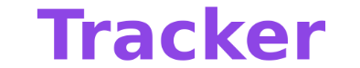
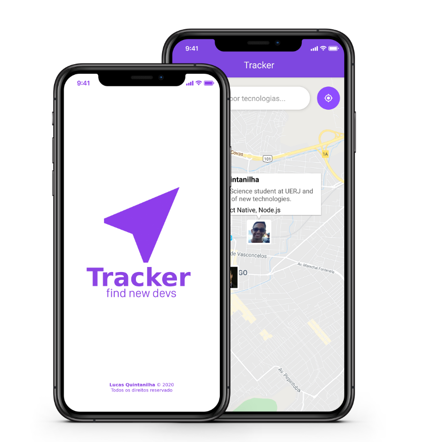

<h1 align="center">
  
</h1>

<h4 align="center"> Find new devs</h4>

  
  
  
  

  

  

## 🚀 Tecnologias  

Esse projeto foi desenvolvido com as seguintes tecnologias:  

- [Node.js](https://nodejs.org/en/)
- [React](https://reactjs.org)
- [React Native](https://facebook.github.io/react-native/)
- [Expo](https://expo.io/)

## 🔨 Projeto

O Tracker permite que desenvolvedores sejam localizados de acordo com suas capacidades.

## ⚡ Utilização

Para testar a ferramente é necessário utilizar o [Yarn](https://yarnpkg.com/lang/en/)/[npm](https://www.npmjs.com/). 
Faça o download do repositório e inicie os scripts de cada pasta.

  <a href="./backend">Backend</a>&nbsp;&nbsp;&nbsp;|&nbsp;&nbsp;&nbsp;
  <a href="./web">Web</a>&nbsp;&nbsp;&nbsp;|&nbsp;&nbsp;&nbsp;
  <a href="./mobile">Mobile</a>

  

