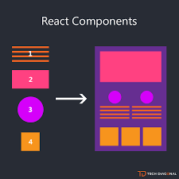

<h1 align="center" >React</h1>

## - Componente
O componente é uma função que retorna algum conteúdo, seja HTML, CSS ou Javascript que não interfere no resto da aplicação.
Componentes devem ser criado quando pode ser isolado na aplicação ou quando um trexo se repete muitas vezes.
Devemos criar apenas **um** componente por arquivo, por questão de boa prática.

  

## - Propriedade
A propriedade nada mais é do que o atributo que um componente pai passa para o componente FILHO.
Para acessar esse atributo, ao criaar o componente deve se passar no cabeçalho a *props* 

## - Estado
São informações mantidas pelo componente. 
O React aposta no conceito de imutabilidade, isto é: um dado não pode ser alterado. É criado um novo dado que substitui a antiga informação. Por exemplo:

~~~jsx
import React, { useState } from 'react';

function App() {
  const [counter, setCounter] = useState(0);

  function incrementCounter() {
    setCounter(counter + 1);
  }

  return (
    <>
      <h1>Constador: {counter}</h1>
      <button onClick={setCounter}>Incrementar</button>
    </>
  );

}

export default App;
~~~
